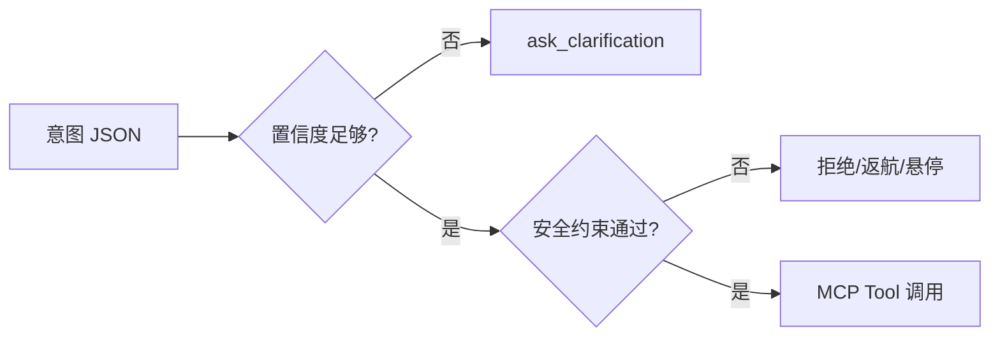

# MCP 语义适配器

MCP 语义适配器负责把结构化意图转换成可执行的无人机工具调用，并把无人机状态暴露给 LLM 或控制逻辑。

## What it is

普通 MCP server 可以把无人机动作封装成工具，例如 `takeoff`、`land`、`move`、`capture_image`。本项目的“语义适配器”在此基础上多做两件事：第一，接收的是意图 JSON，而不只是人工写死的动作参数；第二，工具调用前必须检查语义置信度、环境状态和安全规则。

## Suggested interface

Resources:

- `drone.status`：电量、高度、速度、连接状态。
- `drone.sensors`：避障、IMU、GPS 或模拟器状态。
- `scene.objects`：视觉模块识别到的目标与置信度。
- `mission.context`：当前任务、最近指令、禁飞约束。

Tools:

- `takeoff`
- `land`
- `move`
- `rotate`
- `capture_image`
- `return_home`
- `emergency_stop`
- `ask_clarification`

## Safety gate

## Relationship to other concepts

- [[entities/drone-mcp|drone-mcp]] — 可作为最小 MCP 工具封装参考。
- [[SemanticDrone 系统架构]] — MCP 适配器位于协议层。
- [[实验验证指标]] — 适配器需要记录延迟、失败原因和安全拒绝。

## Open questions

- 工具 schema 应该由谁定义：实验组统一，还是每个实验独立演化？
- 高风险动作是否需要人工二次确认？
- 如何把 MCP 调用日志转化为实验数据？

## Sources

- [[summaries/student-technical-guide]]
- [[summaries/stitp-proposal]]
- [[summaries/drone-mcp]]
