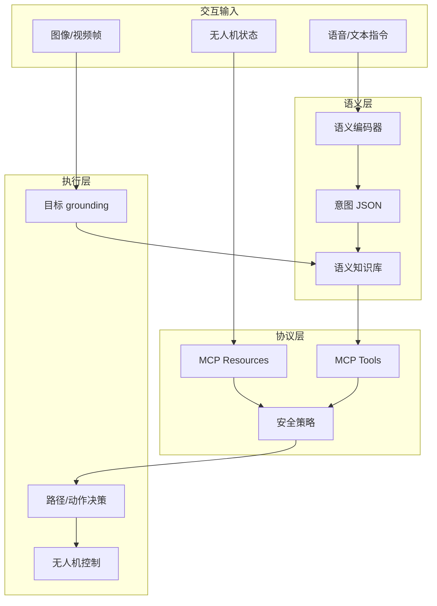

# SemanticDrone 系统架构

SemanticDrone 是一个“语义输入-协议映射-具身执行”的闭环系统。它不是单个模型，也不是单纯无人机控制脚本，而是一组可验证的模块接口。

## What it is

申报书把系统拆成三层：语义编码层、协议适配层、具身执行层。为了让学生可执行，本仓库进一步把它转化为四个实验闭环：意图解析、MCP 工具封装、视觉 grounding、语义鲁棒性评估。

## Module boundaries

- 语义编码层：负责把自然语言或语音转为结构化意图，不直接控制无人机。
- 协议适配层：负责把意图映射为 MCP 工具调用，并暴露实时状态资源。
- 具身执行层：负责视觉目标、空间约束、动作执行和 failsafe。
- 知识库层：负责解释动作、目标、场景、实验结论和失败案例。

## Design rule

每个模块都要输出可记录的中间结果。学生调试时不能只看到“飞了/没飞”，而要看到意图、目标、置信度、安全检查、工具调用和执行结果。

## Relationship to other concepts

- [[无人机语义通信]] — 系统的通信目标。
- [[MCP 语义适配器]] — 协议层核心。
- [[语义知识库]] — 连接人类表达和环境上下文。
- [[实验验证指标]] — 架构是否有效必须用实验而不是感觉判断。

## Sources

- [[summaries/stitp-proposal]]
- [[summaries/student-technical-guide]]
- [[summaries/drone-mcp]]
