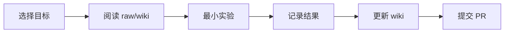

# 学生学习路线

学生学习路线要把“读资料”和“做实验”绑定起来。每读一个资料，至少产出一个 wiki 页面；每做一个实验，至少产出一个指标表或失败分析。

## Four-week starter path

第一周：理解无人机基础控制。目标是让学生能用 DJITelloPy、模拟器或参考项目完成起飞、降落、移动、拍照的最小闭环。

第二周：理解 MCP。目标是跑通一个简单 MCP server，再阅读[[entities/drone-mcp|drone-mcp]]的工具封装方式，写出本项目的工具 schema 草案。

第三周：语音或文本转意图。目标是构建 20 到 30 条指令样例，把自然语言解析为动作、目标、距离、方向和安全约束。

第四周：视觉 grounding 与安全约束。目标是在图像中找到目标，若目标不存在或置信度低，则触发反问或拒绝执行。

## Student contribution loop

## Good first tasks

- 给 30 条无人机自然语言指令做标注。
- 写一个意图 JSON schema。
- 复现 `takeoff`、`land`、`capture_image` 三个 MCP 工具。
- 做一次噪声强度对意图解析的影响测试。
- 总结一个失败案例并补到 wiki。

## Relationship to other concepts

- [[LLM Wiki]] — 学生通过知识库保留学习痕迹。
- [[实验验证指标]] — 每个实验都要有可比较指标。
- [[SemanticDrone 系统架构]] — 路线按系统模块拆分。

## Sources

- [[summaries/code-projects-and-learning-resources]]
- [[summaries/stitp-proposal]]
