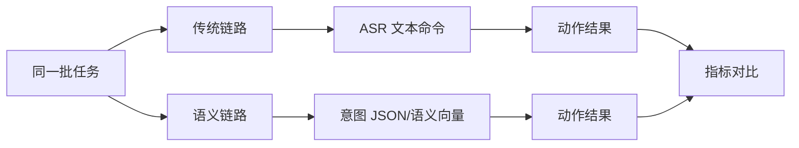

# 实验验证指标

实验指标用于回答一个核心问题：语义链路是否真的比传统命令链路更适合无人机交互。

## Core metrics

- 意图执行成功率：用户真实意图与最终动作是否一致。
- 语义相似度：解析出的意图与标注意图之间的匹配程度。
- 端到端延迟：从用户输入结束到无人机动作响应的时间。
- 平均交互轮次：完成同一任务需要几次澄清或重试。
- 安全拒绝率：危险或低置信度动作被拒绝的比例。
- 误拒绝率：本可执行的安全动作被错误拒绝的比例。
- 传输负载：完成任务所需 token、字节或比特开销。

## Baseline comparison

## Suggested experiment table

| 场景 | 干扰 | 传统成功率 | 语义成功率 | 延迟 | 安全事件 |
|---|---|---:|---:|---:|---:|
| 清晰语音 | 无 | 待测 | 待测 | 待测 | 待测 |
| 旋翼噪声 | 低/中/高 | 待测 | 待测 | 待测 | 待测 |
| 模糊目标 | 多候选目标 | 待测 | 待测 | 待测 | 待测 |
| 弱连接 | 丢包/限速 | 待测 | 待测 | 待测 | 待测 |

## Design notes

所有实验都要保存输入、模型输出、中间意图、安全检查结果、工具调用日志和最终动作。没有日志的 demo 只能算展示，不能算实验。

## Relationship to other concepts

- [[无人机语义通信]] — 提供对比对象。
- [[无人机语义安全]] — 指标中必须包含安全拒绝和异常恢复。
- [[MCP 语义适配器]] — 适配器日志是指标来源。

## Sources

- [[summaries/student-technical-guide]]
- [[summaries/stitp-proposal]]
- [[summaries/uav-semantic-security-review]]
