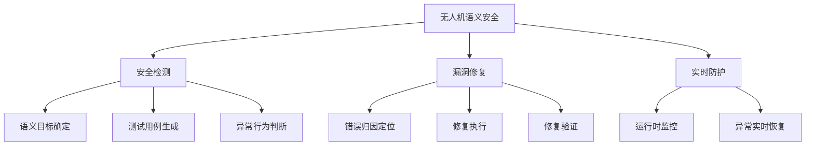

# 无人机语义安全

无人机语义安全关注系统行为是否符合预期语义。它不同于只看软件漏洞或传感器攻击的传统安全，更关心“无人机是否正确理解并执行了应该执行的行为”。

## What it is

综述指出，语义安全问题往往来自无人机自身缺陷、设计边界、性能局限或特定飞行条件组合。即使没有外部攻击，系统也可能因为参数范围、功能实现、群体协同、任务规划或安全策略表达不当而产生危险行为。

对本项目来说，语义安全是[[无人机语义通信]]的必要补充。一个系统即使能把“飞到目标旁边”解析成动作，也必须判断目标是否唯一、距离是否安全、路径是否可达、置信度是否足够、动作是否违反物理约束。

## Research framework from the survey

## Implications for SemanticDrone

- 安全检测：设计模糊指令、低置信度目标、噪声语音、弱信道等测试用例。
- 漏洞修复：记录失败指令和失败状态，定位是解析、grounding、工具映射还是控制执行出错。
- 实时防护：运行时监控电量、距离、速度、置信度和语义冲突，必要时悬停、返航或反问。

## Relationship to other concepts

- [[实验验证指标]] — 安全必须量化。
- [[MCP 语义适配器]] — 工具调用前的 safety gate 是语义安全落地位置。
- [[语义知识库]] — 安全规则需要进入运行时知识库。

## Open questions

- 哪些语义安全目标可以形式化，哪些只能用偏差阈值近似？
- 如何区分“保守拒绝”和“正确拒绝”？
- 实验阶段如何在不实飞的情况下验证危险动作拦截？

## Sources

- [[summaries/uav-semantic-security-review]]
