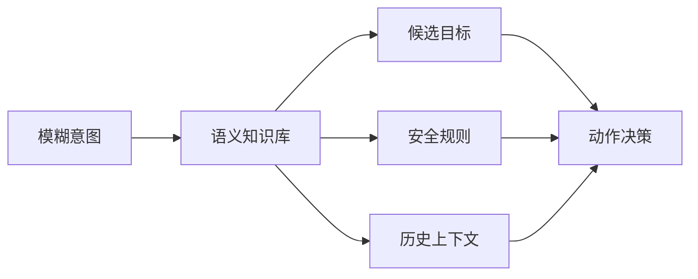

# 语义知识库

语义知识库是无人机与操作者共享上下文的地方：它既包含项目学习资料，也包含系统执行时需要的动作语义、环境语义和安全规则。

## Two meanings in this project

第一层是研究知识库，也就是本仓库的 `raw/` 与 `wiki/`。它帮助学生把综述、开源项目和实验结论编译成可追踪的知识网络。

第二层是系统运行知识库，也就是 SemanticDrone 执行时的场景语义图谱。它记录无人机基础动作、当前目标、空间关系、置信度、安全边界和任务历史，用于补全模糊指令。

## Runtime role

当用户说“向目标靠近”时，系统不能只根据关键词执行。它需要查询当前最可信的目标、目标位置、距离约束、障碍物状态和是否允许靠近。若“目标”有多个候选或置信度不足，就应反问。

## Design notes

- 静态语义：起飞、降落、环绕、返航、拍照等基础动作定义。
- 动态语义：图像中识别到的目标、位置、置信度、可达性。
- 安全语义：禁飞区、最低电量、最大速度、最小距离、低置信度拒绝。
- 学习语义：论文概念、实验结论、失败案例和后续问题。

## Relationship to other concepts

- [[LLM Wiki]] — 研究知识库的组织方法。
- [[无人机语义通信]] — 语义知识库为意图补全提供上下文。
- [[无人机语义安全]] — 安全规则是运行知识库的重要部分。

## Open questions

- 运行时语义知识库先用 JSON、SQLite 还是图数据库？
- 目标置信度如何随时间衰减？
- 学习知识库中的概念能否反哺运行时规则设计？

## Sources

- [[summaries/student-technical-guide]]
- [[summaries/stitp-proposal]]
